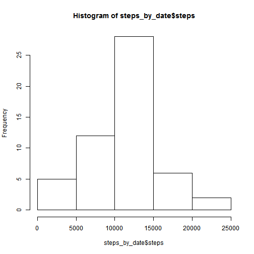
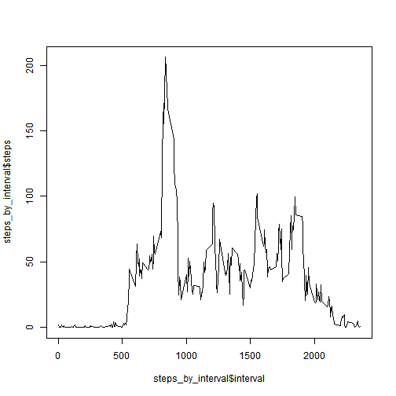
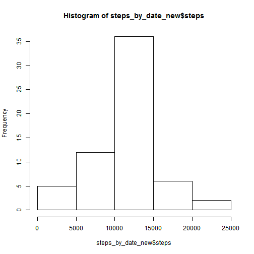
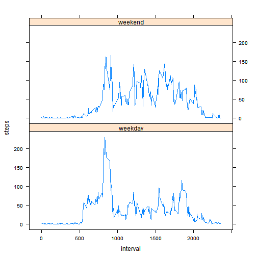

# Reproducible Research: Peer Assessment 1


## Loading and preprocessing the data

### load data


```r
activity <- read.csv("activity.csv")
# head(activity)
```


### agregate by day


```r
steps_by_date <- aggregate(steps ~ date, data = activity, FUN = "sum")
# steps_by_date
```


## What is mean total number of steps taken per day?

### Make a histogram of the total number of steps taken each day


```r
hist(steps_by_date$steps)
```

 


### Calculate and report the mean and median total number of steps taken per day


```r
mean(steps_by_date$steps)
```

```
## [1] 10766
```

```r
median(steps_by_date$steps)
```

```
## [1] 10765
```


##What is the average daily activity pattern?


```r
steps_by_interval <- aggregate(steps ~ interval, data = activity, FUN = "mean")
# head(steps_by_interval)
```


### Make a time series plot (i.e. type = "l") of the 5-minute interval (x-axis) and the average number of steps taken, averaged across all days (y-axis)


```r
plot(steps_by_interval$interval, steps_by_interval$steps, type = "l")
```

 


### Which 5-minute interval, on average across all the days in the dataset, contains the maximum number of steps?

The following code calculates max. number of steps, interval number containing max number of states and the starting minute for this internal:


```r
max(steps_by_interval$steps)
```

```
## [1] 206.2
```

```r
which.max(steps_by_interval$steps)
```

```
## [1] 104
```

```r
steps_by_interval$interval[which.max(steps_by_interval$steps)]
```

```
## [1] 835
```


## Imputing missing values


### Calculate and report the total number of missing values in the dataset 
(i.e. the total number of rows with NAs)


```r
missing_values <- sum(is.na((activity$steps)))
print(missing_values)
```

```
## [1] 2304
```


### Devise a strategy for filling in all of the missing values in the dataset.

The strategy I have chosen is to replace missing values with the the mean for that 5-minute interval


### Create a new dataset that is equal to the original dataset but with the missing data filled in.


```r
activity_new <- read.csv("activity.csv")

# dim(activity_new)[1]
for (i in 1:dim(activity_new)[1]) {
    if (is.na(activity_new$steps[i])) {
        j = i%%288
        if (j == 0) {
            j <- 288
        }
        activity_new$steps[i] <- steps_by_interval$steps[j]
    }
}
# head(activity_new)
```


### Make a histogram of the total number of steps taken each day and Calculate and report the mean and median total number of steps taken per day. 


```r
steps_by_date_new <- aggregate(steps ~ date, data = activity_new, FUN = "sum")
hist(steps_by_date_new$steps)
```

 

```r
mean(steps_by_date_new$steps)
```

```
## [1] 10766
```

```r
median(steps_by_date_new$steps)
```

```
## [1] 10766
```


### Do these values differ from the estimates from the first part of the assignmen? What is the impact of imputing missing data on the estimates of the total daily number of steps?

The mean value is the same. This is because the missing values were for entire days (not like for the values were missing for some intervals withing the day and present for other intervals within the same day).  Under such conditions we effectively imputted the mean value for each of the "missing" days.

The median value slighly changed and became equal to the mean value.


## Are there differences in activity patterns between weekdays and weekends?

### Create a new factor variable in the dataset with two levels - "weekday" and "weekend"


```r
activity_new[, 4] <- "weekday"
names(activity_new)[4] <- "is_weekend"
head(activity_new)
```

```
##     steps       date interval is_weekend
## 1 1.71698 2012-10-01        0    weekday
## 2 0.33962 2012-10-01        5    weekday
## 3 0.13208 2012-10-01       10    weekday
## 4 0.15094 2012-10-01       15    weekday
## 5 0.07547 2012-10-01       20    weekday
## 6 2.09434 2012-10-01       25    weekday
```

```r

for (i in 1:dim(activity_new)[1]) {
    wd <- weekdays(as.Date(activity_new$date[i]))
    if (wd == "Sunday" | wd == "Saturday") {
        activity_new$is_weekend[i] <- "weekend"
    }
}

activity_new$is_weekend <- as.factor(activity_new$is_weekend)

steps_by_interval_new <- aggregate(steps ~ interval + is_weekend, data = activity_new, 
    FUN = "mean")
# head(steps_by_interval_new)
```


### Make a panel plot containing a time series plot  of the 5-minute interval (x-axis) and the average number of steps taken, averaged across all weekday days or weekend days

IMPORTANT: Please install package lattice if it is nor done yet


```r
# install.packages('lattice')
library(lattice)
xyplot(steps ~ interval | is_weekend, steps_by_interval_new, layout = c(1, 2), 
    type = "l")
```

 


We can see that the patterns are quite different on the weekends and weekday.   On the weekdays there is a clear pick of steps in the morning (eveidntly, when people go to work).  There is a such peack on the weekend to, but it is much smaller and number of steps during the other hours of the day is higher than on the weekdays.    
